# Sarvesh Raam T K
**Software Engineer | XAI Researcher | Data Science Enthusiast**

Building modular intelligence engines and visualizing the "why" behind AI decisions. Specially focused on Explainable AI (XAI) and Clinical Intelligence.

<table width="100%">
  <tr>
    <td width="50%" valign="top">
      
    </td>
    <td width="50%" valign="top">
      
    </td>
  </tr>
</table>
